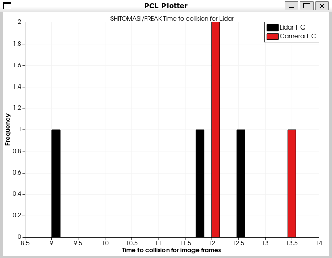
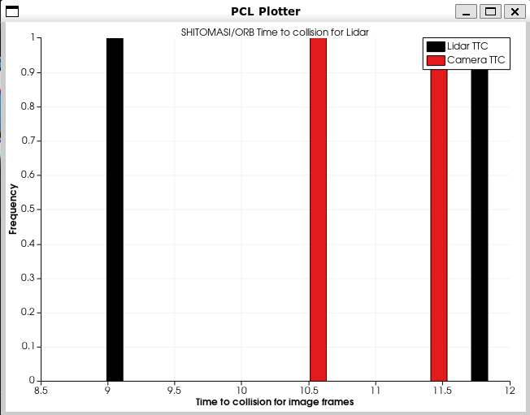
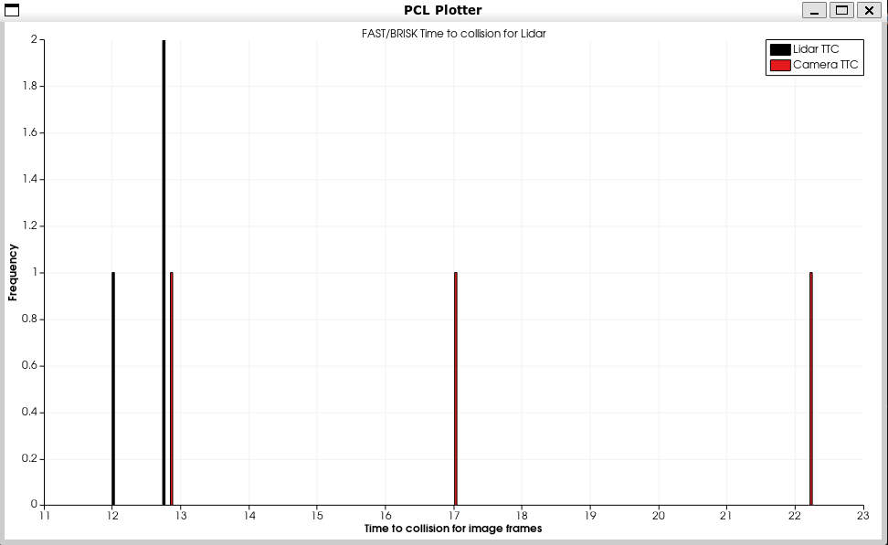
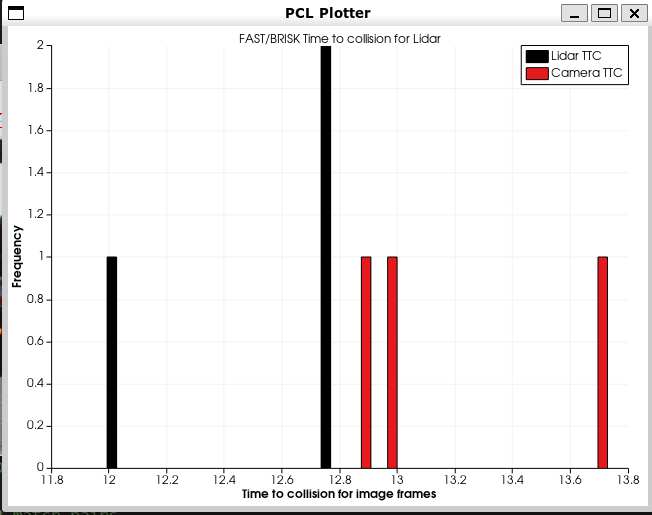
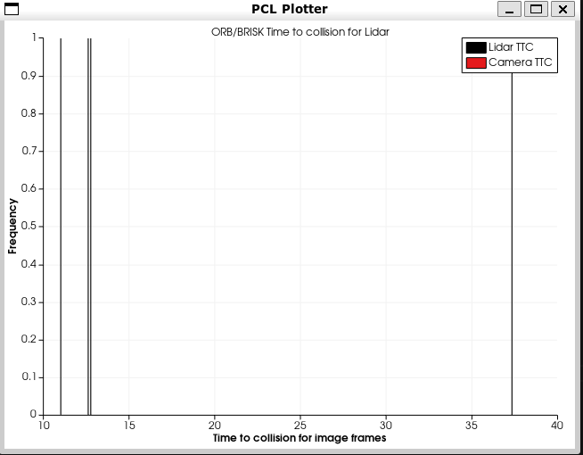
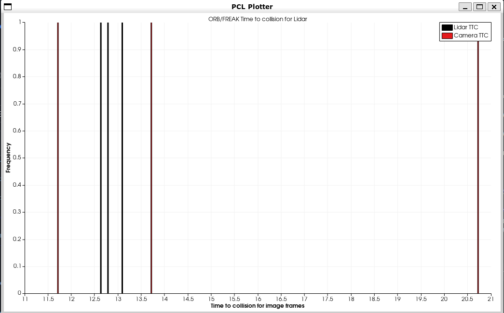
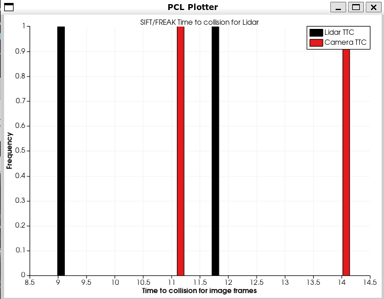

## Author: Shantam Bajpai

# SFND 3D Object Tracking

Welcome to the final project of the camera course. By completing all the lessons, you now have a solid understanding of keypoint detectors, descriptors, and methods to match them between successive images. Also, you know how to detect objects in an image using the YOLO deep-learning framework. And finally, you know how to associate regions in a camera image with Lidar points in 3D space. Let's take a look at our program schematic to see what we already have accomplished and what's still missing.

In this final project, you will implement the missing parts in the schematic. To do this, you will complete four major tasks: 
1. First, you will develop a way to match 3D objects over time by using keypoint correspondences. 
2. Second, you will compute the TTC based on Lidar measurements. 
3. You will then proceed to do the same using the camera, which requires to first associate keypoint matches to regions of interest and then to compute the TTC based on those matches. 
4. And lastly, you will conduct various tests with the framework. Your goal is to identify the most suitable detector/descriptor combination for TTC estimation and also to search for problems that can lead to faulty measurements by the camera or Lidar sensor. In the last course of this Nanodegree, you will learn about the Kalman filter, which is a great way to combine the two independent TTC measurements into an improved version which is much more reliable than a single sensor alone can be. But before we think about such things, let us focus on your final project in the camera course. 
# Performance Evaluations and Description of each part of the project

## FP.1 Match 3D Objects

In the first task I developed a function to match bounding boxes between previous and current frames based upon maximum number of keypoint correspondences. The function took as inputs the keypoint matches, previous and current frames and a map to store the best bounding box matches with their box Ids. The logic I followed for implementing this part was to first create a vector of matched keypoints that stored the x and y coordinates of the previous and current frames. To do this I had to create an additional structure and iterated over the input keypoint matches of type cv::DMatch. After the completion I create 2 additional maps to store the boxIds as keys in the previous and current frames and the number of keypoints contained inside each box as values. In addition I also create an std::pair object for computing the difference between keypoints contained inside the box matches so that the match with the minimum difference could be selected as the best match.

## FP.2 Compute Lidar based TTC

In this part of the project I had to compute the Time to collision based on Lidar measurements of the preceding vehicle. The function took as input the lidar points in the previous and current frames,framerate and a TTC passed as reference so that we can see its updated value outside the function. The logic that is followed here is to first isolate the Lidar points inside the bounding box and especially on the bumper of the car. After that to reject outliers we use the median of the lidar point to compute the Time to collision by pluggin it into the equations of motion for constant velocity.

Formula for Lidar based TTC = CurrentMedianLidar * (delta_t) / (PreviousMedianLidar - CurrentMedianLidar)

## FP.3 Associate keypoint correspondences with Bounding Box

In this part I wrote a function to associate/match keypoints in the previous and current frames by isolating the keypoints inside the current bounding box in the current frame and then match it with its respective previous frame keypoint. For filtering the outliers computed the euclidean distance between each keypoint match , took its mean and then recomputed mean for each match so that if any match has a mean distance greater than that value it will be omitted. This was used in the next part for Time to collision estimation using camera.

## FP.4 Camera based TTC computation

The camera based TTC computation is based on Texture keypoints and the scale change of the vehicle. What I did here was compute the distances between each keypoint within the bounding box region of the car for each frame and then eliminated those which had a distance less than 100.0 (Probably due to the width of the vehicle and the diagonal length of the vehicle). Now using the TTC formula derived using the Constant velocity model the time to computation was determined. In addition for outlier reject the median of the distance ratios in the previous and current frame was used.

Formula for TTC = - (delta_t) / (1- h1/h0)

## FP.5 Performance Evaluation 1 (Describing examples where Lidar TTC estimations is off)

The Lidar measurements are almost always right and I did not come across a detector descriptor combinatation where the lidar TTC Estimation was wrong. The range was always in between 8-13 meters. The median filtering worked really well in removing outliers for TTC Lidar prediction. Although the Camera estimates were off sometimes as can be seen in the histograms plotted below.

## FP.6 Performance Evaluation 2 

I have plotted histograms of Time to collision using the Point Cloud Library. Please be sure to install PCL from the documentation provided online. Updates to CMakeLists.txt have been made to incorporate it.

### Histogram for TTC Lidar and Camera using SHITOMASI Keypoint and FREAK Descriptor

### Histogram for TTC Lidar and Camera using SHITOMASI Keypoint and ORB Descriptor

### Histogram for TTC Lidar and Camera using FAST Keypoint and BRIEF Descriptor

### Histogram for TTC Lidar and Camera using FAST Keypoint and BRISK Descriptor

### Histogram for TTC Lidar and Camera using ORB Keypoint and BRISK Descriptor

### Histogram for TTC Lidar and Camera using ORB Keypoint and FREAK Descriptor

### Histogram for TTC Lidar and Camera using SIFT Keypoint and FREAK Descriptor

## Dependencies for Running Locally
* cmake >= 2.8
  * All OSes: [click here for installation instructions](https://cmake.org/install/)
* make >= 4.1 (Linux, Mac), 3.81 (Windows)
  * Linux: make is installed by default on most Linux distros
  * Mac: [install Xcode command line tools to get make](https://developer.apple.com/xcode/features/)
  * Windows: [Click here for installation instructions](http://gnuwin32.sourceforge.net/packages/make.htm)
* Git LFS
  * Weight files are handled using [LFS](https://git-lfs.github.com/)
* OpenCV >= 4.1
  * This must be compiled from source using the `-D OPENCV_ENABLE_NONFREE=ON` cmake flag for testing the SIFT and SURF detectors.
  * The OpenCV 4.1.0 source code can be found [here](https://github.com/opencv/opencv/tree/4.1.0)
* gcc/g++ >= 5.4
  * Linux: gcc / g++ is installed by default on most Linux distros
  * Mac: same deal as make - [install Xcode command line tools](https://developer.apple.com/xcode/features/)
  * Windows: recommend using [MinGW](http://www.mingw.org/)

## Basic Build Instructions

1. Clone this repo.
2. Make a build directory in the top level project directory: `mkdir build && cd build`
3. Compile: `cmake .. && make`
4. Run it: `./3D_object_tracking`.
